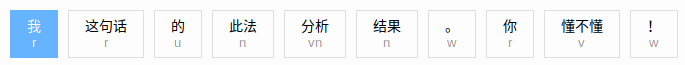
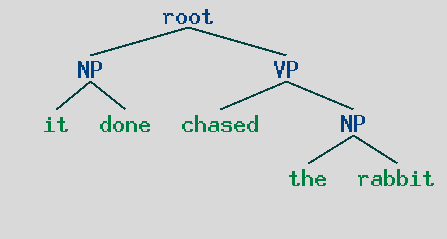
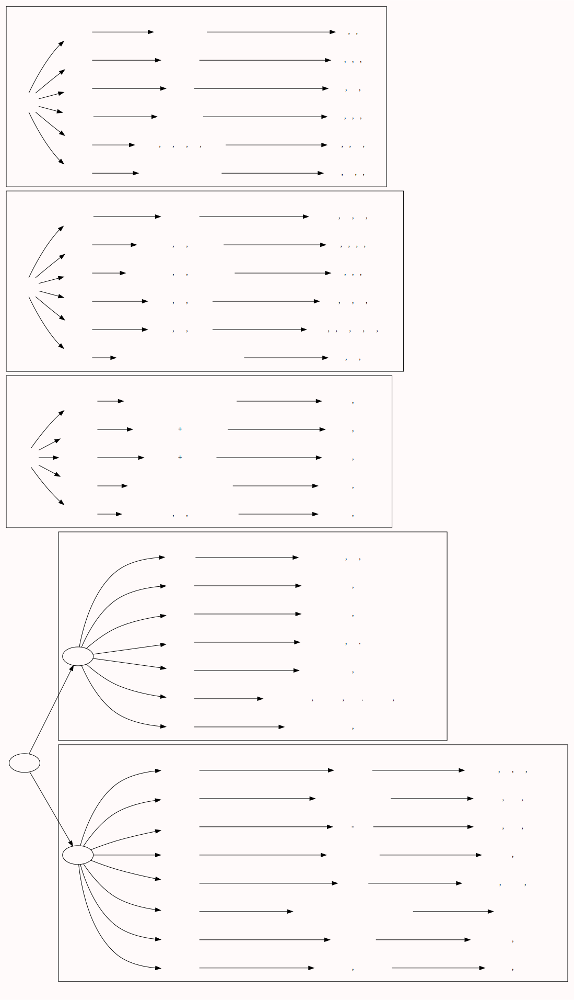

  

# 自然语言处理相关

[TOC]

    

> 本文所记内容均为个人见解；忽略语音处理部分

  
## 基本内容
###自然语言处理的两个分野
- 自然语言理解：文字表示-> 语义表示
- 自然语言生成：语义表示-> 文字表示
### 问题？
- 什么是语义？（类继承的角度看：名词？）如何表示语义？（一阶逻辑）
- 什么是智能？ 图灵测试（看外部行为）？
- 语言服务于群体交流，语言是否就是群体中的个体之间传递信息的一种方式？
- 语言有“表情达意”功能，除了*传达信息*  还有别的作用吗？
- 为什么一定要识别命名实体呢?
	- 命名实体一般都好几个字;不好标注{荷兰,...}
	- "非命名实体识别"{是,在,要}:单个字的情况多,也好标注
## 基本技术
- 中文分词  ：  中文词与词之间没有空格分割，不同于英文
- 命名实体识别（NER）:1、提取。2、分类
- 标注（part-of-speech tagging, POS tagging）  
  
- 语法分析:  
> (root (NP it done) (VP chased (NP the rabbit)))  
  
- 语义分析
### 方法：
- 分类：为给定的输入选择正确的类标签
- 标注
- 树
- n-gram分词/标注
- 依存分析：非常困难
### 难点
- 歧义：(1-> n)
	- 无法通过·现在的状态·确定·未来的状态·
	- 解决方法：
		- 选择概率最大项（马尔可夫链，朴素贝叶斯） 
- 常识：机器并没有人类所处环境的基本认知
- 推理：让机器成为并超越： 福尔摩斯
	- 与歧义，常识具有一定的关联；但层次更高范围更大；
	- 解决方法：有向图模型
- 

## 处理过程
- 现代机器：[语音；图像]-> 文字-> 语义-> 文字-> [语音；图像]
- 不识字的人： 语音->语义-> 语音；
- 读书的人：图像->文字->（语义。。。）->（文字？）->语音；
- 看书的人：图像-> 文字-> 语义；
- 撕书的人：图像-> 文字-> 语义-> 动作；

### 受语言学的影响
- 语言学是 人们把 自身学习过程的经验 总结为 规则（语法）
	- 其构建 语法分析树 的思想影响至今
- 语言学将 语音 和 文字 看作两个系统
	- 于是有了[现代机器]的语言<-->文字的双向转换过程
- 

## 自然语言处理的几个历史阶段
> 只是大概时间，没有认真查资料；

- 规则阶段：1960s->1990s
	- 借鉴 语言学和信息论
	- 将语法规则搬到计算机上
	- 专家系统（语言学专家）
	- 面临的困难：人们无法穷举所有规则且规则在变
	
- 概率阶段：1990s->2010s
	- 借鉴 概率论，统计学，离散数学
	- 通过概率的方法来 消除歧义
	- 面临的困难：参数太多，需要的计算量太大
	
- 神经网络阶段：2010s-> ...
	- 借鉴 人工神经网络
### 总结
- 现在可以很明显的看到上面三个历史阶段的影响：
	- 能够用规则文法解决的问题就构建规则模型（人力）
	- 规则模型代价太大（标注的人力成本太高）的话就构建概率模型（算力）
	- 概率模型的计算成本太大的话就使用神经网络模型（算法）
- 而在提高模型正确率的路上往往与上面相反；（BERT使用了3亿参数！）
- 
### word2vec 
- 建立文字到向量的映射：“中” => [0.34,0.24,...,0.78]
- 尽量使语义相似的词语的的向量表示的距离相近。
 
### 原则
- 组合原则:整体的含义是部分的含义与它们的句法结合方式的函数
- ！
## 算法：
- 决策树：
- 贝叶斯分类器：
- 最大熵分类器：
- 移进-规约分析器
- 

### 评测指标
- 精确度（P）=真正判断对的/模型判断认为对的
- 召回率（R：recall）= 真正判断对的/真正对的数量
- F-score=2×P×R/（P+R）
- 例子：句子里有100个分词点；模型划分了90个；模型划分对了80个
	- P=80/90; R=80/100；
- 交叉验证：按比例 随机划分 训练集和测试集
## 链接

[globalwordnet](http://globalwordnet.org/)  
[中文wordnet](http://lope.linguistics.ntu.edu.tw/cwn/)  
[语言资料归档](http://www.language-archives.org/)  
[世界语言种类](https://www.ethnologue.com/)  
[绘制树图](https://networkx.lanl.gov/)  
[百度NLP平台](https://cloud.baidu.com/product/nlp.html)  

## 哲学
- 理性主义（笛卡尔天赋）&&经验主义（洛克知识来源于经验）
- 现实主义&&理想主义
- 我们关注编程本身也只是一种解决问题的手段
### 百度NLP
说反话：  

---

  
转折：  

---

  

- 尝试了13个行业标签都没有分析结果的句子：  

---

  

### 基本结论
- 即使用图灵测试（黑盒测试）的标准这个NLP产品也不够智能！
- 自然语言处理仍然任重而道远！

## 基本汉语语法

## 一些想法
- 人们对语言的处理存在一个快速的结果映射.真正的语义其实并不重要,
	- 就像有时人们明明说错了一个句子[双重否定],但对方却正确的理解了你要表达的意思
	- [表达的一方错了,但理解的一方却得到了正确的解释.可见人们对于语义的理解]
	- 并没有单纯的依赖语音信息.语义的传达是一个综合的形式,而非单一
			就像语言包含:肢体动作\语调\表情\眼神etc
		- 看书是一个例外[一目十行除外]
		- 看书:抽象的符号{图片} + {声音}如何表示?  --> 序列化[进入大脑]
		- 数据在大脑中重构.   神经网络实现了上述映射过程
	- 而语义的理解过程在于 已识别对象间的映射[语义映射]
- 神经网络有能力实现语义映射吗?
	- 启发: 词向量:每一个词的多维表示可以看成高位空间上的一个点
		- 而一句话则可以看作高位空间的一条线,语义相似的词在语义空间中实现聚集[聚类]
		- 此时句义可以看做词义空间的线性连接
- 声音的表示:
	- 频率/振幅/采样频率/振幅存储位数/  : 也可以看作一张图片

---

- 即使在你睡觉的时候大脑也是活跃的
- 我们所有的行为都会改变大脑{有限度的}
- 长期记忆是需要时间来进行大脑重构{练习}
- 促进大脑改变的主要动力是行为{神经网络的输入决定了其结构}
- 大多数的系统要么非常简单， 要么极其复杂
- 图像语言  所有人都能流利使用的语言   图像
- 图像不仅能够表达概念,还可以通过生活需求[现实]进一步影响情感

## 歧义整理
- 韵母:[部分无法显示]  
>ā\á\ǎ\à  
ō \ó \ǒ \ò  
ē\ é\ ě\ è  
ī\ \í\ǐ\ ì  
ū ú ǔ ù  
ǖ\ǘ\ ǚ\ ǜ

---

- 二兩二:2.2: [ èr,liǎng , èr]
- 俩二两:2*2:[ liǎ ,èr, liǎng]

## 

