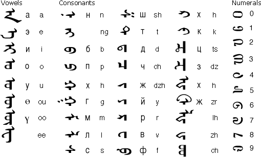

<link type="text/css" rel="stylesheet" href="/css/GitHub_Word.css">
  
# 有趣的语言
  

 2019起

  

---

> 知：闻、说、亲；  
> 名，实，合，为；  ——《墨子 经上》

> 解释：知道的方式有：听到的，推理到的，亲自感受到的；  
> 先知道名字，然后是实体，再统一到一起，用来作为实践的依据

---

## 谁从电影里走出来?
A:你想要哪个人从电影里走出来?    
B:日本电影可不可以?  
C:是贞子吗?哈哈哈  

## 小可爱是谁？
1.  你是谁？我是爱你的\小可爱。
	- 我->小可爱
2. 你到底爱谁？我是爱你的\小可爱。
	- 对方->小可爱
3. 你到底爱谁？我是爱\你的小可爱。
	- 对方的某个东西->小可爱
## 吃泡面
- 没钱吃泡面，现在\没钱吃泡面
	- 1.没钱的时候就吃泡面，而现在连吃泡面的钱都没了
- 没钱吃泡面，现在没钱\吃泡面
	- 2.没有钱的话就吃泡面，现在没钱所以只能吃泡面
- 中国有两种球很奇特，一个乒乓球**谁也赢不了**，还有一种足球也是谁也赢不了————网易云评论
- 俞敏洪称不少老师没能力教好学生
	- 老师没能力/教/好学生
	- 老师没能力/教好/学生
- 
## 重复
- 重复会改变语义:
	- 爱&& 爱爱
	- 骂他就行了&&骂骂他就行了
	- 哄[骗]谁呢&& 哄哄她
	- 恍惚&& 恍恍惚惚
	- 
- 重复加重语气

---

##反向认知
- 名取：取名，命名
- 熊猫：猫熊
- 私自：自私
- 大取：取大
- 工人&& 人工；劳工&&功劳；
- 精神&& 神经
- 

#名词
- 博士学位(全写为 Doctor of Philosophy
- 丁克（DINK，double income and no kids
- 梭哈释义：将全部资产作为赌注，孤注一掷的行为。
- 吗妈咪呀:意大利语=oh my god=我的天哪

---

###2025蒙古国实行 传统蒙古文

- 回鹘（拼音：huí hú；维吾尔文：Uyghur）
- 回纥(ge1)

---
    
# 完

    