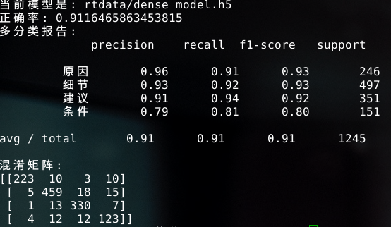
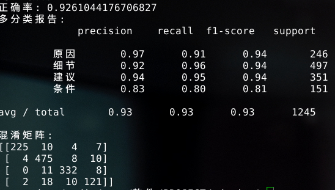
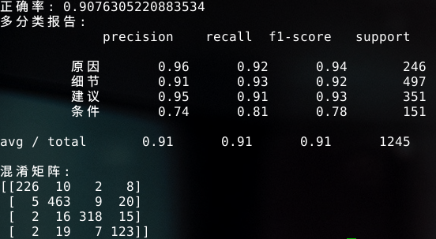
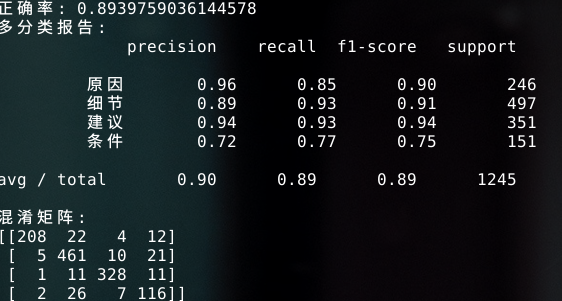

# 用神经网络进行文本意见识别
- neural network opinion recognition

- 2018-5-6

> 使用神经网络进行解释性意见句分类

1. 用到的neural_network:  
	- 包含CNN、GRU、FCN、LSTM等神经网络
- 分类标签：
	- '原因', '细节', '建议','条件'
- 工具：
	- jieba ：分词
	- word2vec ：向量化
	- keras/tensorflow ：神经网络训练工具
	- numpy ：矩阵化
- 结果截图：
	- dense model：
		
	- GRU model：
		
	-  LSTM model ：
		
	-  RNN model :
		
- 其他：
	- 词向量长度：30 （默认）