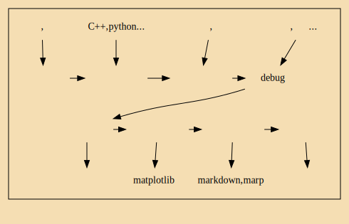
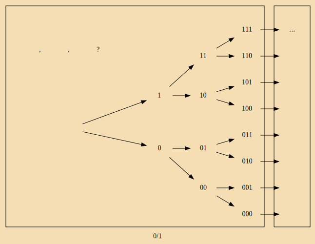

# CL  and DL
存放计算语言学CL(自然语言处理NLP)及深度学习DL相关内容

## ER：emotion recognition
情感识别：意见句正面/负面情感分类

## ML_model:mechine learn model

机器学习模型：除深度学习外的项目涉及到的其他机器学习算法模型

## neural network opinion recognition(NN_OR)

神经网络意见识别：识别四种不同类型的解释性意见句。

### pict
- 存放图片的文件夹
### note_algo
- 算法笔记:《算法导论》... ...
- 

## 其他

