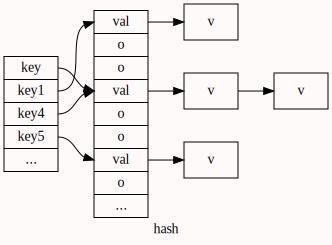
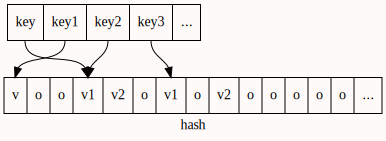

# 算法导论
- 作为一名工程师,面对NPC更好的做法是开发一种近似算法.
- 随机和均匀分布往往容易混淆(参考:knuth:计算机程序设计艺术2:半数值算法,第三章)
	- 随机可能不均匀分布,例:筛子连续摇出三个6
	- 均匀分布也可能不随机,例:顺序遍历
	- 随机强调的是不可预测性,分布是一列数据的状态
- 深度学习展示了识别功能的不确定性,也可以说是灵活性
- 
## 概念:
- **算法**就是定义良好的计算过程
- **数据结构**是存储和组织数据的一种方式
- $O(n)=c_1n+c_2$:一个函数的渐进上界.
	- $f(n)<cg(n)  => f(n)=O(g(n))$
- $\Omega (n)=c_1n+c$:一个函数的渐进下界.
- $\Theta (n)=f(n),c_1g(n) < f(n) < c_2g(n)$
	- $f(n)=an^2+bn+c => f(n)=\Theta (n^2)$
	- $\Omega(n) < \Theta (n) < O(n)$ :个人见解
	- $\Theta (n^2) : 两个for嵌套,n为数据集大小$
	- $log_{2} n : 平衡二叉树查找$
	- $O(n):顺序查找$
- 不是所有的作者都以相同的形式来定义渐进符号.
- $O$表示方法的讨论:
	- $O()$表示的是最差时间复杂度,而不是平均时间复杂度 $\Theta ()$	
	- 散列表的平均时间复杂度是$\Theta (1)$:实际上它需要(拉链法)$n/k,k是地址空间大小$(开放寻址法,内存利用率低)
	- 平衡查找树的平均时间复杂度是$\Theta (log_2n)$,感觉上明显比散列表的$\Theta (1)$要慢,实际上**1万万亿**个数据的查找次数是$log_2(10000,0000,0000,0000)=53.1508$而且是均匀分布上的确定性的常数查找时间的数据结构
	- 那为什么现在许多语言的标准库的字典(Dict)都是使用散列表实现呢?
		- 1\实现起来简单.2\人们大多数情况下接触到的都是小型的数据量
		- 3\硬件限制:天河计算机的内存:如下算式;4\可以用二级散列来解决
		$$1.4PB  多大? ==> 1024^5:16位=2^{50}$$
		
- **概率分析**:在问题的分析中应用概率技术.
- **随机算法**:一个算法的行为不只是由输入决定,同时也由随机数生成器所产生的数值决定.则称这个算法是随机的.
- 随机算法通常是解决问题最简单也是最有效的方法.
- **堆**数据结构是一种数组对象.
- 集合也是计算机科学的基础
- 栈:先进后出;LIFO
- 队列:先进先出;FIFO
- 链表:简单灵活表示动态集合,效率不高
	- 链表的意义:兼具顺序连接与指针,可以表示树,图,栈,队列....
- 基于指针的数据结构看上去似乎也是一项"来自民间的发明"
- 完全散列(prefect hashing):某种散列查找技术的最坏情况内存访问次数为$O(1)$
---

- 设计算法,证明其正确性,理解其效率
- 更严格的表示法会使代数运算变得复杂化.
- 计算中位数所需要的精确(最小)比较次数仍然是未知的.
	- 找到最大和最小值就需要2n次比较.
	- 问题可以转化为找到前n/2+1个元素(已排序的)
- 查找(search)
---
  
 

- 散列表(hash table):普通数组概念的推广
	- 支持插入,删除,查找的字典操作的动态集合结构:$O(1)->O(n)$
	- 过程: key->hash()->{地址}->value
	- 核心:有关键字计算下标.
	- 散列:key表比value表要大,所以叫散列.
	- 碰撞(colision):两个关键字映射到同一个槽上.
		- 可以通过精心设计散列函数来减少碰撞的发生
		- 此处可以理解为均匀映射(均匀分布)
		- 不说随机:真正的随机结果往往表现出局部的不随机
	- 由"过程"可知,最终的分布取决于设置的key和散列函数
	- 开放寻址法:检查顺序不一定是1,2,3,..m-1.
	- 二级散列:一个key,两个hash函数,两个value表
- 查找树:树高h$O(h)==O(lg(n))$
	- 红黑树是一种二叉查找树,但在每一个节点上增加一个存储位表示节点颜色(红与黑),通过对任何一条路径上的节点颜色限制,可以确保没有一条路径会比其他路径长处两倍.
	- 性质:

- 34:NP 完全性 
	- $O(n^k)$ 多项式时间;n是输入规模;k是常数;
	- P类问题:在多项式时间内可解的问题
	- NP类问题:在多项式时间内"可验证"的问题
	- 如果一个问题属于NP,且与NP中的任何问题是一样难的(hard).则说它属于NPC类,也称为NP完全的
	- 最优化问题:每一种可行解都有一个相关的值,目标是找出一个具有最佳值的可行解.
- 35:近似算法
	- 近似算法:能返回近似最优解的算法
	- !
- 

## 问题猜想
- 睡眠时大脑是否进行神经网络的调整?调整是否是训练后的浮点参数整数化存储?
- !
- 

