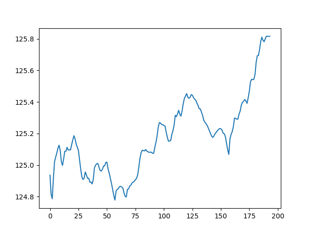

# 项目集合
- 本文件夹存放已经完成的小项目
## 股市
- 对国内沪深股市的基本数据进行统计研究(港股也行)
- 使用sina的股市接口进行信息收集
- 同时收集股票,**债券和基金**.因此最终的结果与当日的综合指数结果不同.
- 本项目所得数据,仅供参考
- 使用方法:
```bash
#设置cron 为工作日9:30,1:00执行analyse.jl文件即可
#秒 分 时 日 月 星期 年 命令 可执行文件
0 30 9 0 0 1/5  julia /path/股市/analyse.jl
0 0 13 0 0 1/5  julia /path/股市/analyse.jl
```
- 环境要求:
	- Julia,python3,PyPlot(julia库)
- 部分结果存放在  "股市/pict/ " 下,


---

## 信息研究
- 在info_research 文件夹下
- 增量化的网络信息采集处理
- 


