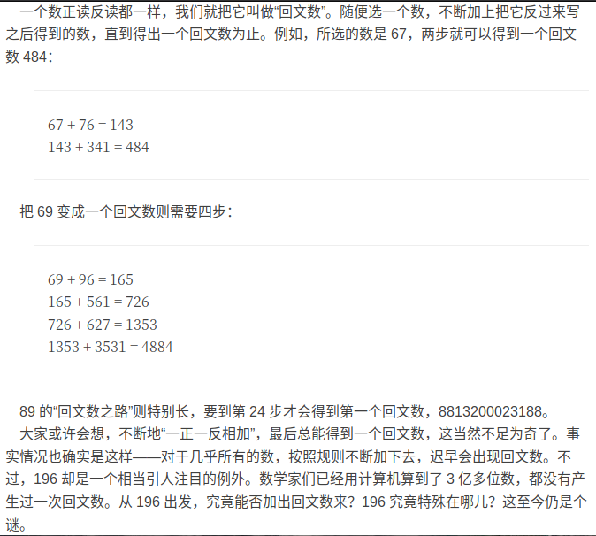

# 生成回文数

[TOC]

下方图片来自matrix67




## 命令
- make cla //默认makefile
- make
- ./app_name >>tmp.txt

---

## 恍然大悟
- 既然196不行,那196+691,...

## C++代码:

```
// 回文数生成
// 目标:数字|步数|对应的回文数

bool huiwen_test(string& str_num)
{
	int len=str_num.size()-1;
	//cout<<len<<"是长度"<<endl;
	for(int i=0;i<=len;i++){ //此处可以len/2取整
		if(str_num[i]==str_num[len-i]){
			continue;
		}else{
			return false;	
		}
	}
	return true;	
}
int huiwenshu(int& num,int& count)
{
	string str1=to_string(num);
	string str2;
	str2.assign(str1.rbegin(),str1.rend());
	//cout<<str2<<"position-----"<<endl;
	int tmp=stoi(str2);
	
	//cout<<"输出的值"<<tmp<<endl;
	num+=tmp;
	str1=to_string(num);
	count++;
	//cout<<"输入的值"<<num<<endl;
	if(huiwen_test(str1)){
		return num;
	}else{
		return huiwenshu(num,count);
	}
}


#include<boost/multiprecision/cpp_int.hpp> 
#include <boost/lexical_cast.hpp>
using namespace boost::multiprecision;

cpp_int huiwenshu1(cpp_int& num,int& count)
{
	string str1=lexical_cast<string>(num);
	string str2;
	str2.assign(str1.rbegin(),str1.rend());
	//cout<<str2<<"position-----"<<endl;
	cpp_int tmp=lexical_cast<cpp_int>(str2);
	
	//cout<<"输出的值"<<tmp<<endl;
	num+=tmp;
	str1=lexical_cast<string>(num);
	count++;
	//cout<<"输入的值"<<num<<" count="<<count<<endl;
	if(huiwen_test(str1)){
		return num;
	}else{
		if(count>100){
			return 0;
		}else{
			return huiwenshu1(num,count);
		}
	}
}

 

bool control(long endval)
{
	int start=12;
	int tmp;
	while(start<=endval){
		tmp=start;
		int count=0;
		try{
			int result=0;
			string str1=to_string(tmp);
			if(huiwen_test(str1)){
				result=tmp;
			}else{
				result=huiwenshu(tmp,count);
			}
			cout<<start<<"使用步数为"
				<<count<<";对应的回文数为:"
				<<result<<endl;
//此处输出为int值的回文数
		}catch(...){
			cpp_int tmp1=tmp;
			try{
				cpp_int val=huiwenshu1(tmp1,count);
				cout<<start<<"步数:"
					<<count<<"大数结果"
					<<val<<endl;
//此处输出为大数表示的回文值
			}catch(runtime_error& e){
				cout<<start++<<endl;	
//此处输出为100步以内大数表示异常
				continue;
			}
		}
		start++;
	}
	return true;	
}
//调用处
control(1500);

```


## 数据:


```

12使用步数为1;对应的回文数为:33
13使用步数为1;对应的回文数为:44
14使用步数为1;对应的回文数为:55
15使用步数为1;对应的回文数为:66
16使用步数为1;对应的回文数为:77
17使用步数为1;对应的回文数为:88
18使用步数为1;对应的回文数为:99
19使用步数为2;对应的回文数为:121
20使用步数为1;对应的回文数为:22
21使用步数为1;对应的回文数为:33
22使用步数为0;对应的回文数为:22
23使用步数为1;对应的回文数为:55
24使用步数为1;对应的回文数为:66
25使用步数为1;对应的回文数为:77
26使用步数为1;对应的回文数为:88
27使用步数为1;对应的回文数为:99
28使用步数为2;对应的回文数为:121
29使用步数为1;对应的回文数为:121
30使用步数为1;对应的回文数为:33
31使用步数为1;对应的回文数为:44
32使用步数为1;对应的回文数为:55
33使用步数为0;对应的回文数为:33
34使用步数为1;对应的回文数为:77
35使用步数为1;对应的回文数为:88
36使用步数为1;对应的回文数为:99
37使用步数为2;对应的回文数为:121
38使用步数为1;对应的回文数为:121
39使用步数为2;对应的回文数为:363
40使用步数为1;对应的回文数为:44
41使用步数为1;对应的回文数为:55
42使用步数为1;对应的回文数为:66
43使用步数为1;对应的回文数为:77
44使用步数为0;对应的回文数为:44
45使用步数为1;对应的回文数为:99
46使用步数为2;对应的回文数为:121
47使用步数为1;对应的回文数为:121
48使用步数为2;对应的回文数为:363
49使用步数为2;对应的回文数为:484
50使用步数为1;对应的回文数为:55
51使用步数为1;对应的回文数为:66
52使用步数为1;对应的回文数为:77
53使用步数为1;对应的回文数为:88
54使用步数为1;对应的回文数为:99
55使用步数为0;对应的回文数为:55
56使用步数为1;对应的回文数为:121
57使用步数为2;对应的回文数为:363
58使用步数为2;对应的回文数为:484
59使用步数为3;对应的回文数为:1111
60使用步数为1;对应的回文数为:66
61使用步数为1;对应的回文数为:77
62使用步数为1;对应的回文数为:88
63使用步数为1;对应的回文数为:99
64使用步数为2;对应的回文数为:121
65使用步数为1;对应的回文数为:121
66使用步数为0;对应的回文数为:66
67使用步数为2;对应的回文数为:484
68使用步数为3;对应的回文数为:1111
69使用步数为4;对应的回文数为:4884
70使用步数为1;对应的回文数为:77
71使用步数为1;对应的回文数为:88
72使用步数为1;对应的回文数为:99
73使用步数为2;对应的回文数为:121
74使用步数为1;对应的回文数为:121
75使用步数为2;对应的回文数为:363
76使用步数为2;对应的回文数为:484
77使用步数为0;对应的回文数为:77
78使用步数为4;对应的回文数为:4884
79使用步数为6;对应的回文数为:44044
80使用步数为1;对应的回文数为:88
81使用步数为1;对应的回文数为:99
82使用步数为2;对应的回文数为:121
83使用步数为1;对应的回文数为:121
84使用步数为2;对应的回文数为:363
85使用步数为2;对应的回文数为:484
86使用步数为3;对应的回文数为:1111
87使用步数为4;对应的回文数为:4884
88使用步数为0;对应的回文数为:88
89步数:24大数结果8813200023188
90使用步数为1;对应的回文数为:99
91使用步数为2;对应的回文数为:121
92使用步数为1;对应的回文数为:121
93使用步数为2;对应的回文数为:363
94使用步数为2;对应的回文数为:484
95使用步数为3;对应的回文数为:1111
96使用步数为4;对应的回文数为:4884
97使用步数为6;对应的回文数为:44044
98步数:24大数结果8813200023188
99使用步数为0;对应的回文数为:99
100使用步数为1;对应的回文数为:101
101使用步数为0;对应的回文数为:101
102使用步数为1;对应的回文数为:303
103使用步数为1;对应的回文数为:404
104使用步数为1;对应的回文数为:505
105使用步数为1;对应的回文数为:606
106使用步数为1;对应的回文数为:707
107使用步数为1;对应的回文数为:808
108使用步数为1;对应的回文数为:909
109使用步数为2;对应的回文数为:1111
110使用步数为1;对应的回文数为:121
111使用步数为0;对应的回文数为:111
112使用步数为1;对应的回文数为:323
113使用步数为1;对应的回文数为:424
114使用步数为1;对应的回文数为:525
115使用步数为1;对应的回文数为:626
116使用步数为1;对应的回文数为:727
117使用步数为1;对应的回文数为:828
118使用步数为1;对应的回文数为:929
119使用步数为2;对应的回文数为:1331
120使用步数为1;对应的回文数为:141
121使用步数为0;对应的回文数为:121
122使用步数为1;对应的回文数为:343
123使用步数为1;对应的回文数为:444
124使用步数为1;对应的回文数为:545
125使用步数为1;对应的回文数为:646
126使用步数为1;对应的回文数为:747
127使用步数为1;对应的回文数为:848
128使用步数为1;对应的回文数为:949
129使用步数为2;对应的回文数为:1551
130使用步数为1;对应的回文数为:161
131使用步数为0;对应的回文数为:131
132使用步数为1;对应的回文数为:363
133使用步数为1;对应的回文数为:464
134使用步数为1;对应的回文数为:565
135使用步数为1;对应的回文数为:666
136使用步数为1;对应的回文数为:767
137使用步数为1;对应的回文数为:868
138使用步数为1;对应的回文数为:969
139使用步数为2;对应的回文数为:1771
140使用步数为1;对应的回文数为:181
141使用步数为0;对应的回文数为:141
142使用步数为1;对应的回文数为:383
143使用步数为1;对应的回文数为:484
144使用步数为1;对应的回文数为:585
145使用步数为1;对应的回文数为:686
146使用步数为1;对应的回文数为:787
147使用步数为1;对应的回文数为:888
148使用步数为1;对应的回文数为:989
149使用步数为2;对应的回文数为:1991
150使用步数为2;对应的回文数为:303
151使用步数为0;对应的回文数为:151
152使用步数为2;对应的回文数为:707
153使用步数为2;对应的回文数为:909
154使用步数为2;对应的回文数为:1111
155使用步数为3;对应的回文数为:4444
156使用步数为3;对应的回文数为:6666
157使用步数为3;对应的回文数为:8888
158使用步数为3;对应的回文数为:11011
159使用步数为2;对应的回文数为:1221
160使用步数为2;对应的回文数为:343
161使用步数为0;对应的回文数为:161
162使用步数为2;对应的回文数为:747
163使用步数为2;对应的回文数为:949
164使用步数为3;对应的回文数为:2662
165使用步数为3;对应的回文数为:4884
166使用步数为5;对应的回文数为:45254
167使用步数为11;对应的回文数为:88555588
168使用步数为3;对应的回文数为:13431
169使用步数为2;对应的回文数为:1441
170使用步数为2;对应的回文数为:383
171使用步数为0;对应的回文数为:171
172使用步数为2;对应的回文数为:787
173使用步数为2;对应的回文数为:989
174使用步数为4;对应的回文数为:5115
175使用步数为4;对应的回文数为:9559
176使用步数为5;对应的回文数为:44044
177步数:15大数结果8836886388
178使用步数为3;对应的回文数为:15851
179使用步数为2;对应的回文数为:1661
180使用步数为3;对应的回文数为:747
181使用步数为0;对应的回文数为:181
182使用步数为6;对应的回文数为:45254
183使用步数为4;对应的回文数为:13431
184使用步数为3;对应的回文数为:2552
185使用步数为3;对应的回文数为:4774
186使用步数为3;对应的回文数为:6996
187步数:23大数结果8813200023188
188使用步数为7;对应的回文数为:233332
189使用步数为2;对应的回文数为:1881
190使用步数为7;对应的回文数为:45254
191使用步数为0;对应的回文数为:191
192使用步数为4;对应的回文数为:6996
193使用步数为8;对应的回文数为:233332
194使用步数为3;对应的回文数为:2992
195使用步数为4;对应的回文数为:9339
196步数:101大数结果0
197使用步数为7;对应的回文数为:881188
198使用步数为5;对应的回文数为:79497
199使用步数为3;对应的回文数为:3113
200使用步数为1;对应的回文数为:202
201使用步数为1;对应的回文数为:303
202使用步数为0;对应的回文数为:202
203使用步数为1;对应的回文数为:505
204使用步数为1;对应的回文数为:606
205使用步数为1;对应的回文数为:707
206使用步数为1;对应的回文数为:808
207使用步数为1;对应的回文数为:909
208使用步数为2;对应的回文数为:1111
209使用步数为1;对应的回文数为:1111
210使用步数为1;对应的回文数为:222
211使用步数为1;对应的回文数为:323
212使用步数为0;对应的回文数为:212
213使用步数为1;对应的回文数为:525
214使用步数为1;对应的回文数为:626
215使用步数为1;对应的回文数为:727
216使用步数为1;对应的回文数为:828
217使用步数为1;对应的回文数为:929
218使用步数为2;对应的回文数为:1331
219使用步数为2;对应的回文数为:2442
220使用步数为1;对应的回文数为:242
221使用步数为1;对应的回文数为:343
222使用步数为0;对应的回文数为:222
223使用步数为1;对应的回文数为:545
224使用步数为1;对应的回文数为:646
225使用步数为1;对应的回文数为:747
226使用步数为1;对应的回文数为:848
227使用步数为1;对应的回文数为:949
228使用步数为2;对应的回文数为:1551
229使用步数为2;对应的回文数为:2662
230使用步数为1;对应的回文数为:262
231使用步数为1;对应的回文数为:363
232使用步数为0;对应的回文数为:232
233使用步数为1;对应的回文数为:565
234使用步数为1;对应的回文数为:666
235使用步数为1;对应的回文数为:767
236使用步数为1;对应的回文数为:868
237使用步数为1;对应的回文数为:969
238使用步数为2;对应的回文数为:1771
239使用步数为2;对应的回文数为:2882
240使用步数为1;对应的回文数为:282
241使用步数为1;对应的回文数为:383
242使用步数为0;对应的回文数为:242
243使用步数为1;对应的回文数为:585
244使用步数为1;对应的回文数为:686
245使用步数为1;对应的回文数为:787
246使用步数为1;对应的回文数为:888
247使用步数为1;对应的回文数为:989
248使用步数为2;对应的回文数为:1991
249使用步数为3;对应的回文数为:5115
250使用步数为2;对应的回文数为:505
251使用步数为2;对应的回文数为:707
252使用步数为0;对应的回文数为:252
253使用步数为2;对应的回文数为:1111
254使用步数为3;对应的回文数为:4444
255使用步数为3;对应的回文数为:6666
256使用步数为3;对应的回文数为:8888
257使用步数为3;对应的回文数为:11011
258使用步数为2;对应的回文数为:1221
259使用步数为2;对应的回文数为:2332
260使用步数为2;对应的回文数为:545
261使用步数为2;对应的回文数为:747
262使用步数为0;对应的回文数为:262
263使用步数为3;对应的回文数为:2662
264使用步数为3;对应的回文数为:4884
265使用步数为5;对应的回文数为:45254
266使用步数为11;对应的回文数为:88555588
267使用步数为3;对应的回文数为:13431
268使用步数为2;对应的回文数为:1441
269使用步数为2;对应的回文数为:2552
270使用步数为2;对应的回文数为:585
271使用步数为2;对应的回文数为:787
272使用步数为0;对应的回文数为:272
273使用步数为4;对应的回文数为:5115
274使用步数为4;对应的回文数为:9559
275使用步数为5;对应的回文数为:44044
276步数:15大数结果8836886388
277使用步数为3;对应的回文数为:15851
278使用步数为2;对应的回文数为:1661
279使用步数为2;对应的回文数为:2772
280使用步数为4;对应的回文数为:2662
281使用步数为6;对应的回文数为:45254
282使用步数为0;对应的回文数为:282
283使用步数为3;对应的回文数为:2552
284使用步数为3;对应的回文数为:4774
285使用步数为3;对应的回文数为:6996
286步数:23大数结果8813200023188
287使用步数为7;对应的回文数为:233332
288使用步数为2;对应的回文数为:1881
289使用步数为2;对应的回文数为:2992
290使用步数为4;对应的回文数为:2552
291使用步数为4;对应的回文数为:6996
292使用步数为0;对应的回文数为:292
293使用步数为3;对应的回文数为:2992
294使用步数为4;对应的回文数为:9339
295步数:101大数结果0
296使用步数为7;对应的回文数为:881188
297使用步数为5;对应的回文数为:79497
298使用步数为3;对应的回文数为:3113
299使用步数为3;对应的回文数为:5335
300使用步数为1;对应的回文数为:303
301使用步数为1;对应的回文数为:404
302使用步数为1;对应的回文数为:505
303使用步数为0;对应的回文数为:303
304使用步数为1;对应的回文数为:707
305使用步数为1;对应的回文数为:808
306使用步数为1;对应的回文数为:909
307使用步数为2;对应的回文数为:1111
308使用步数为1;对应的回文数为:1111
309使用步数为2;对应的回文数为:3333
310使用步数为1;对应的回文数为:323
311使用步数为1;对应的回文数为:424
312使用步数为1;对应的回文数为:525
313使用步数为0;对应的回文数为:313
314使用步数为1;对应的回文数为:727
315使用步数为1;对应的回文数为:828
316使用步数为1;对应的回文数为:929
317使用步数为2;对应的回文数为:1331
318使用步数为2;对应的回文数为:2442
319使用步数为2;对应的回文数为:3553
320使用步数为1;对应的回文数为:343
321使用步数为1;对应的回文数为:444
322使用步数为1;对应的回文数为:545
323使用步数为0;对应的回文数为:323
324使用步数为1;对应的回文数为:747
325使用步数为1;对应的回文数为:848
326使用步数为1;对应的回文数为:949
327使用步数为2;对应的回文数为:1551
328使用步数为2;对应的回文数为:2662
329使用步数为2;对应的回文数为:3773
330使用步数为1;对应的回文数为:363
331使用步数为1;对应的回文数为:464
332使用步数为1;对应的回文数为:565
333使用步数为0;对应的回文数为:333
334使用步数为1;对应的回文数为:767
335使用步数为1;对应的回文数为:868
336使用步数为1;对应的回文数为:969
337使用步数为2;对应的回文数为:1771
338使用步数为2;对应的回文数为:2882
339使用步数为2;对应的回文数为:3993
340使用步数为1;对应的回文数为:383
341使用步数为1;对应的回文数为:484
342使用步数为1;对应的回文数为:585
343使用步数为0;对应的回文数为:343
344使用步数为1;对应的回文数为:787
345使用步数为1;对应的回文数为:888
346使用步数为1;对应的回文数为:989
347使用步数为2;对应的回文数为:1991
348使用步数为3;对应的回文数为:5115
349使用步数为3;对应的回文数为:7337
350使用步数为2;对应的回文数为:707
351使用步数为2;对应的回文数为:909
352使用步数为2;对应的回文数为:1111
353使用步数为0;对应的回文数为:353
354使用步数为3;对应的回文数为:6666
355使用步数为3;对应的回文数为:8888
356使用步数为3;对应的回文数为:11011
357使用步数为2;对应的回文数为:1221
358使用步数为2;对应的回文数为:2332
359使用步数为2;对应的回文数为:3443
360使用步数为2;对应的回文数为:747
361使用步数为2;对应的回文数为:949
362使用步数为3;对应的回文数为:2662
363使用步数为0;对应的回文数为:363
364使用步数为5;对应的回文数为:45254
365使用步数为11;对应的回文数为:88555588
366使用步数为3;对应的回文数为:13431
367使用步数为2;对应的回文数为:1441
368使用步数为2;对应的回文数为:2552
369使用步数为2;对应的回文数为:3663
370使用步数为2;对应的回文数为:787
371使用步数为2;对应的回文数为:989
372使用步数为4;对应的回文数为:5115
373使用步数为0;对应的回文数为:373
374使用步数为5;对应的回文数为:44044
375步数:15大数结果8836886388
376使用步数为3;对应的回文数为:15851
377使用步数为2;对应的回文数为:1661
378使用步数为2;对应的回文数为:2772
379使用步数为2;对应的回文数为:3883
380使用步数为6;对应的回文数为:45254
381使用步数为4;对应的回文数为:13431
382使用步数为3;对应的回文数为:2552
383使用步数为0;对应的回文数为:383
384使用步数为3;对应的回文数为:6996
385步数:23大数结果8813200023188
386使用步数为7;对应的回文数为:233332
387使用步数为2;对应的回文数为:1881
388使用步数为2;对应的回文数为:2992
389使用步数为3;对应的回文数为:7117
390使用步数为4;对应的回文数为:6996
391使用步数为8;对应的回文数为:233332
392使用步数为3;对应的回文数为:2992
393使用步数为0;对应的回文数为:393
394步数:101大数结果0
395使用步数为7;对应的回文数为:881188
396使用步数为5;对应的回文数为:79497
397使用步数为3;对应的回文数为:3113
398使用步数为3;对应的回文数为:5335
399使用步数为3;对应的回文数为:7557
400使用步数为1;对应的回文数为:404
401使用步数为1;对应的回文数为:505
402使用步数为1;对应的回文数为:606
403使用步数为1;对应的回文数为:707
404使用步数为0;对应的回文数为:404
405使用步数为1;对应的回文数为:909
406使用步数为2;对应的回文数为:1111
407使用步数为1;对应的回文数为:1111
408使用步数为2;对应的回文数为:3333
409使用步数为2;对应的回文数为:4444
410使用步数为1;对应的回文数为:424
411使用步数为1;对应的回文数为:525
412使用步数为1;对应的回文数为:626
413使用步数为1;对应的回文数为:727
414使用步数为0;对应的回文数为:414
415使用步数为1;对应的回文数为:929
416使用步数为2;对应的回文数为:1331
417使用步数为2;对应的回文数为:2442
418使用步数为2;对应的回文数为:3553
419使用步数为2;对应的回文数为:4664
420使用步数为1;对应的回文数为:444
421使用步数为1;对应的回文数为:545
422使用步数为1;对应的回文数为:646
423使用步数为1;对应的回文数为:747
424使用步数为0;对应的回文数为:424
425使用步数为1;对应的回文数为:949
426使用步数为2;对应的回文数为:1551
427使用步数为2;对应的回文数为:2662
428使用步数为2;对应的回文数为:3773
429使用步数为2;对应的回文数为:4884
430使用步数为1;对应的回文数为:464
431使用步数为1;对应的回文数为:565
432使用步数为1;对应的回文数为:666
433使用步数为1;对应的回文数为:767
434使用步数为0;对应的回文数为:434
435使用步数为1;对应的回文数为:969
436使用步数为2;对应的回文数为:1771
437使用步数为2;对应的回文数为:2882
438使用步数为2;对应的回文数为:3993
439使用步数为3;对应的回文数为:9119
440使用步数为1;对应的回文数为:484
441使用步数为1;对应的回文数为:585
442使用步数为1;对应的回文数为:686
443使用步数为1;对应的回文数为:787
444使用步数为0;对应的回文数为:444
445使用步数为1;对应的回文数为:989
446使用步数为2;对应的回文数为:1991
447使用步数为3;对应的回文数为:5115
448使用步数为3;对应的回文数为:7337
449使用步数为3;对应的回文数为:9559
450使用步数为2;对应的回文数为:909
451使用步数为2;对应的回文数为:1111
452使用步数为3;对应的回文数为:4444
453使用步数为3;对应的回文数为:6666
454使用步数为0;对应的回文数为:454
455使用步数为3;对应的回文数为:11011
456使用步数为2;对应的回文数为:1221
457使用步数为2;对应的回文数为:2332
458使用步数为2;对应的回文数为:3443
459使用步数为2;对应的回文数为:4554
460使用步数为2;对应的回文数为:949
461使用步数为3;对应的回文数为:2662
462使用步数为3;对应的回文数为:4884
463使用步数为5;对应的回文数为:45254
464使用步数为0;对应的回文数为:464
465使用步数为3;对应的回文数为:13431
466使用步数为2;对应的回文数为:1441
467使用步数为2;对应的回文数为:2552
468使用步数为2;对应的回文数为:3663
469使用步数为2;对应的回文数为:4774
470使用步数为2;对应的回文数为:989
471使用步数为4;对应的回文数为:5115
472使用步数为4;对应的回文数为:9559
473使用步数为5;对应的回文数为:44044
474使用步数为0;对应的回文数为:474
475使用步数为3;对应的回文数为:15851
476使用步数为2;对应的回文数为:1661
477使用步数为2;对应的回文数为:2772
478使用步数为2;对应的回文数为:3883
479使用步数为2;对应的回文数为:4994
480使用步数为4;对应的回文数为:13431
481使用步数为3;对应的回文数为:2552
482使用步数为3;对应的回文数为:4774
483使用步数为3;对应的回文数为:6996
484使用步数为0;对应的回文数为:484
485使用步数为7;对应的回文数为:233332
486使用步数为2;对应的回文数为:1881
487使用步数为2;对应的回文数为:2992
488使用步数为3;对应的回文数为:7117
489使用步数为3;对应的回文数为:9339
490使用步数为8;对应的回文数为:233332
491使用步数为3;对应的回文数为:2992
492使用步数为4;对应的回文数为:9339
493步数:101大数结果0
494使用步数为0;对应的回文数为:494
495使用步数为5;对应的回文数为:79497
496使用步数为3;对应的回文数为:3113
497使用步数为3;对应的回文数为:5335
498使用步数为3;对应的回文数为:7557
499使用步数为3;对应的回文数为:9779
500使用步数为1;对应的回文数为:505
501使用步数为1;对应的回文数为:606
502使用步数为1;对应的回文数为:707
503使用步数为1;对应的回文数为:808
504使用步数为1;对应的回文数为:909
505使用步数为0;对应的回文数为:505
506使用步数为1;对应的回文数为:1111
507使用步数为2;对应的回文数为:3333
508使用步数为2;对应的回文数为:4444
509使用步数为2;对应的回文数为:5555
510使用步数为1;对应的回文数为:525
511使用步数为1;对应的回文数为:626
512使用步数为1;对应的回文数为:727
513使用步数为1;对应的回文数为:828
514使用步数为1;对应的回文数为:929
515使用步数为0;对应的回文数为:515
516使用步数为2;对应的回文数为:2442
517使用步数为2;对应的回文数为:3553
518使用步数为2;对应的回文数为:4664
519使用步数为2;对应的回文数为:5775
520使用步数为1;对应的回文数为:545
521使用步数为1;对应的回文数为:646
522使用步数为1;对应的回文数为:747
523使用步数为1;对应的回文数为:848
524使用步数为1;对应的回文数为:949
525使用步数为0;对应的回文数为:525
526使用步数为2;对应的回文数为:2662
527使用步数为2;对应的回文数为:3773
528使用步数为2;对应的回文数为:4884
529使用步数为2;对应的回文数为:5995
530使用步数为1;对应的回文数为:565
531使用步数为1;对应的回文数为:666
532使用步数为1;对应的回文数为:767
533使用步数为1;对应的回文数为:868
534使用步数为1;对应的回文数为:969
535使用步数为0;对应的回文数为:535
536使用步数为2;对应的回文数为:2882
537使用步数为2;对应的回文数为:3993
538使用步数为3;对应的回文数为:9119
539使用步数为4;对应的回文数为:25652
540使用步数为1;对应的回文数为:585
541使用步数为1;对应的回文数为:686
542使用步数为1;对应的回文数为:787
543使用步数为1;对应的回文数为:888
544使用步数为1;对应的回文数为:989
545使用步数为0;对应的回文数为:545
546使用步数为3;对应的回文数为:5115
547使用步数为3;对应的回文数为:7337
548使用步数为3;对应的回文数为:9559
549使用步数为5;对应的回文数为:59895
550使用步数为2;对应的回文数为:1111
551使用步数为3;对应的回文数为:4444
552使用步数为3;对应的回文数为:6666
553使用步数为3;对应的回文数为:8888
554使用步数为3;对应的回文数为:11011
555使用步数为0;对应的回文数为:555
556使用步数为2;对应的回文数为:2332
557使用步数为2;对应的回文数为:3443
558使用步数为2;对应的回文数为:4554
559使用步数为2;对应的回文数为:5665
560使用步数为3;对应的回文数为:2662
561使用步数为3;对应的回文数为:4884
562使用步数为5;对应的回文数为:45254
563使用步数为11;对应的回文数为:88555588
564使用步数为3;对应的回文数为:13431
565使用步数为0;对应的回文数为:565
566使用步数为2;对应的回文数为:2552
567使用步数为2;对应的回文数为:3663
568使用步数为2;对应的回文数为:4774
569使用步数为2;对应的回文数为:5885
570使用步数为4;对应的回文数为:5115
571使用步数为4;对应的回文数为:9559
572使用步数为5;对应的回文数为:44044
573步数:15大数结果8836886388
574使用步数为3;对应的回文数为:15851
575使用步数为0;对应的回文数为:575
576使用步数为2;对应的回文数为:2772
577使用步数为2;对应的回文数为:3883
578使用步数为2;对应的回文数为:4994
579使用步数为4;对应的回文数为:23232
580使用步数为3;对应的回文数为:2552
581使用步数为3;对应的回文数为:4774
582使用步数为3;对应的回文数为:6996
583步数:23大数结果8813200023188
584使用步数为7;对应的回文数为:233332
585使用步数为0;对应的回文数为:585
586使用步数为2;对应的回文数为:2992
587使用步数为3;对应的回文数为:7117
588使用步数为3;对应的回文数为:9339
589使用步数为8;对应的回文数为:1136311
590使用步数为3;对应的回文数为:2992
591使用步数为4;对应的回文数为:9339
592步数:101大数结果0
593使用步数为7;对应的回文数为:881188
594使用步数为5;对应的回文数为:79497
595使用步数为0;对应的回文数为:595
596使用步数为3;对应的回文数为:5335
597使用步数为3;对应的回文数为:7557
598使用步数为3;对应的回文数为:9779
599使用步数为4;对应的回文数为:22022
600使用步数为1;对应的回文数为:606
601使用步数为1;对应的回文数为:707
602使用步数为1;对应的回文数为:808
603使用步数为1;对应的回文数为:909
604使用步数为2;对应的回文数为:1111
605使用步数为1;对应的回文数为:1111
606使用步数为0;对应的回文数为:606
607使用步数为2;对应的回文数为:4444
608使用步数为2;对应的回文数为:5555
609使用步数为2;对应的回文数为:6666
610使用步数为1;对应的回文数为:626
611使用步数为1;对应的回文数为:727
612使用步数为1;对应的回文数为:828
613使用步数为1;对应的回文数为:929
614使用步数为2;对应的回文数为:1331
615使用步数为2;对应的回文数为:2442
616使用步数为0;对应的回文数为:616
617使用步数为2;对应的回文数为:4664
618使用步数为2;对应的回文数为:5775
619使用步数为2;对应的回文数为:6886
620使用步数为1;对应的回文数为:646
621使用步数为1;对应的回文数为:747
622使用步数为1;对应的回文数为:848
623使用步数为1;对应的回文数为:949
624使用步数为2;对应的回文数为:1551
625使用步数为2;对应的回文数为:2662
626使用步数为0;对应的回文数为:626
627使用步数为2;对应的回文数为:4884
628使用步数为2;对应的回文数为:5995
629使用步数为4;对应的回文数为:45254
630使用步数为1;对应的回文数为:666
631使用步数为1;对应的回文数为:767
632使用步数为1;对应的回文数为:868
633使用步数为1;对应的回文数为:969
634使用步数为2;对应的回文数为:1771
635使用步数为2;对应的回文数为:2882
636使用步数为0;对应的回文数为:636
637使用步数为3;对应的回文数为:9119
638使用步数为4;对应的回文数为:25652
639使用步数为5;对应的回文数为:99099
640使用步数为1;对应的回文数为:686
641使用步数为1;对应的回文数为:787
642使用步数为1;对应的回文数为:888
643使用步数为1;对应的回文数为:989
644使用步数为2;对应的回文数为:1991
645使用步数为3;对应的回文数为:5115
646使用步数为0;对应的回文数为:646
647使用步数为3;对应的回文数为:9559
648使用步数为5;对应的回文数为:59895
649使用步数为4;对应的回文数为:44044
650使用步数为3;对应的回文数为:4444
651使用步数为3;对应的回文数为:6666
652使用步数为3;对应的回文数为:8888
653使用步数为3;对应的回文数为:11011
654使用步数为2;对应的回文数为:1221
655使用步数为2;对应的回文数为:2332
656使用步数为0;对应的回文数为:656
657使用步数为2;对应的回文数为:4554
658使用步数为2;对应的回文数为:5665
659使用步数为2;对应的回文数为:6776
660使用步数为3;对应的回文数为:4884
661使用步数为5;对应的回文数为:45254
662使用步数为11;对应的回文数为:88555588
663使用步数为3;对应的回文数为:13431
664使用步数为2;对应的回文数为:1441
665使用步数为2;对应的回文数为:2552
666使用步数为0;对应的回文数为:666
667使用步数为2;对应的回文数为:4774
668使用步数为2;对应的回文数为:5885
669使用步数为2;对应的回文数为:6996
670使用步数为4;对应的回文数为:9559
671使用步数为5;对应的回文数为:44044
672步数:15大数结果8836886388
673使用步数为3;对应的回文数为:15851
674使用步数为2;对应的回文数为:1661
675使用步数为2;对应的回文数为:2772
676使用步数为0;对应的回文数为:676
677使用步数为2;对应的回文数为:4994
678使用步数为4;对应的回文数为:23232
679使用步数为4;对应的回文数为:47674
680使用步数为3;对应的回文数为:4774
681使用步数为3;对应的回文数为:6996
682步数:23大数结果8813200023188
683使用步数为7;对应的回文数为:233332
684使用步数为2;对应的回文数为:1881
685使用步数为2;对应的回文数为:2992
686使用步数为0;对应的回文数为:686
687使用步数为3;对应的回文数为:9339
688使用步数为8;对应的回文数为:1136311
689步数:101大数结果0
690使用步数为4;对应的回文数为:9339
691步数:101大数结果0
692使用步数为7;对应的回文数为:881188
693使用步数为5;对应的回文数为:79497
694使用步数为3;对应的回文数为:3113
695使用步数为3;对应的回文数为:5335
696使用步数为0;对应的回文数为:696
697使用步数为3;对应的回文数为:9779
698使用步数为4;对应的回文数为:22022
699使用步数为4;对应的回文数为:46464
700使用步数为1;对应的回文数为:707
701使用步数为1;对应的回文数为:808
702使用步数为1;对应的回文数为:909
703使用步数为2;对应的回文数为:1111
704使用步数为1;对应的回文数为:1111
705使用步数为2;对应的回文数为:3333
706使用步数为2;对应的回文数为:4444
707使用步数为0;对应的回文数为:707
708使用步数为2;对应的回文数为:6666
709使用步数为2;对应的回文数为:7777
710使用步数为1;对应的回文数为:727
711使用步数为1;对应的回文数为:828
712使用步数为1;对应的回文数为:929
713使用步数为2;对应的回文数为:1331
714使用步数为2;对应的回文数为:2442
715使用步数为2;对应的回文数为:3553
716使用步数为2;对应的回文数为:4664
717使用步数为0;对应的回文数为:717
718使用步数为2;对应的回文数为:6886
719使用步数为2;对应的回文数为:7997
720使用步数为1;对应的回文数为:747
721使用步数为1;对应的回文数为:848
722使用步数为1;对应的回文数为:949
723使用步数为2;对应的回文数为:1551
724使用步数为2;对应的回文数为:2662
725使用步数为2;对应的回文数为:3773
726使用步数为2;对应的回文数为:4884
727使用步数为0;对应的回文数为:727
728使用步数为4;对应的回文数为:45254
729使用步数为4;对应的回文数为:69696
730使用步数为1;对应的回文数为:767
731使用步数为1;对应的回文数为:868
732使用步数为1;对应的回文数为:969
733使用步数为2;对应的回文数为:1771
734使用步数为2;对应的回文数为:2882
735使用步数为2;对应的回文数为:3993
736使用步数为3;对应的回文数为:9119
737使用步数为0;对应的回文数为:737
738使用步数为5;对应的回文数为:99099
739
740使用步数为1;对应的回文数为:787
741使用步数为1;对应的回文数为:888
742使用步数为1;对应的回文数为:989
743使用步数为2;对应的回文数为:1991
744使用步数为3;对应的回文数为:5115
745使用步数为3;对应的回文数为:7337
746使用步数为3;对应的回文数为:9559
747使用步数为0;对应的回文数为:747
748使用步数为4;对应的回文数为:44044
749使用步数为4;对应的回文数为:68486
750使用步数为3;对应的回文数为:6666
751使用步数为3;对应的回文数为:8888
752使用步数为3;对应的回文数为:11011
753使用步数为2;对应的回文数为:1221
754使用步数为2;对应的回文数为:2332
755使用步数为2;对应的回文数为:3443
756使用步数为2;对应的回文数为:4554
757使用步数为0;对应的回文数为:757
758使用步数为2;对应的回文数为:6776
759使用步数为2;对应的回文数为:7887
760使用步数为5;对应的回文数为:45254
761使用步数为11;对应的回文数为:88555588
762使用步数为3;对应的回文数为:13431
763使用步数为2;对应的回文数为:1441
764使用步数为2;对应的回文数为:2552
765使用步数为2;对应的回文数为:3663
766使用步数为2;对应的回文数为:4774
767使用步数为0;对应的回文数为:767
768使用步数为2;对应的回文数为:6996
769使用步数为4;对应的回文数为:67276
770使用步数为5;对应的回文数为:44044
771步数:15大数结果8836886388
772使用步数为3;对应的回文数为:15851
773使用步数为2;对应的回文数为:1661
774使用步数为2;对应的回文数为:2772
775使用步数为2;对应的回文数为:3883
776使用步数为2;对应的回文数为:4994
777使用步数为0;对应的回文数为:777
778使用步数为4;对应的回文数为:47674
779使用步数为6;对应的回文数为:475574
780使用步数为3;对应的回文数为:6996
781步数:23大数结果8813200023188
782使用步数为7;对应的回文数为:233332
783使用步数为2;对应的回文数为:1881
784使用步数为2;对应的回文数为:2992
785使用步数为3;对应的回文数为:7117
786使用步数为3;对应的回文数为:9339
787使用步数为0;对应的回文数为:787
788步数:101大数结果0
789使用步数为4;对应的回文数为:66066
790步数:101大数结果0
791使用步数为7;对应的回文数为:881188
792使用步数为5;对应的回文数为:79497
793使用步数为3;对应的回文数为:3113
794使用步数为3;对应的回文数为:5335
795使用步数为3;对应的回文数为:7557
796使用步数为3;对应的回文数为:9779
797使用步数为0;对应的回文数为:797
798使用步数为4;对应的回文数为:46464
799使用步数为6;对应的回文数为:449944
800使用步数为1;对应的回文数为:808
801使用步数为1;对应的回文数为:909
802使用步数为2;对应的回文数为:1111
803使用步数为1;对应的回文数为:1111
804使用步数为2;对应的回文数为:3333
805使用步数为2;对应的回文数为:4444
806使用步数为2;对应的回文数为:5555
807使用步数为2;对应的回文数为:6666
808使用步数为0;对应的回文数为:808
809使用步数为2;对应的回文数为:8888
810使用步数为1;对应的回文数为:828
811使用步数为1;对应的回文数为:929
812使用步数为2;对应的回文数为:1331
813使用步数为2;对应的回文数为:2442
814使用步数为2;对应的回文数为:3553
815使用步数为2;对应的回文数为:4664
816使用步数为2;对应的回文数为:5775
817使用步数为2;对应的回文数为:6886
818使用步数为0;对应的回文数为:818
819使用步数为4;对应的回文数为:89298
820使用步数为1;对应的回文数为:848
821使用步数为1;对应的回文数为:949
822使用步数为2;对应的回文数为:1551
823使用步数为2;对应的回文数为:2662
824使用步数为2;对应的回文数为:3773
825使用步数为2;对应的回文数为:4884
826使用步数为2;对应的回文数为:5995
827使用步数为4;对应的回文数为:45254
828使用步数为0;对应的回文数为:828
829使用步数为10;对应的回文数为:88555588
830使用步数为1;对应的回文数为:868
831使用步数为1;对应的回文数为:969
832使用步数为2;对应的回文数为:1771
833使用步数为2;对应的回文数为:2882
834使用步数为2;对应的回文数为:3993
835使用步数为3;对应的回文数为:9119
836使用步数为4;对应的回文数为:25652
837使用步数为5;对应的回文数为:99099
838使用步数为0;对应的回文数为:838
839使用步数为4;对应的回文数为:88088
840使用步数为1;对应的回文数为:888
841使用步数为1;对应的回文数为:989
842使用步数为2;对应的回文数为:1991
843使用步数为3;对应的回文数为:5115
844使用步数为3;对应的回文数为:7337
845使用步数为3;对应的回文数为:9559
846使用步数为5;对应的回文数为:59895
847使用步数为4;对应的回文数为:44044
848使用步数为0;对应的回文数为:848
849步数:14大数结果8836886388
850使用步数为3;对应的回文数为:8888
851使用步数为3;对应的回文数为:11011
852使用步数为2;对应的回文数为:1221
853使用步数为2;对应的回文数为:2332
854使用步数为2;对应的回文数为:3443
855使用步数为2;对应的回文数为:4554
856使用步数为2;对应的回文数为:5665
857使用步数为2;对应的回文数为:6776
858使用步数为0;对应的回文数为:858
859使用步数为2;对应的回文数为:8998
860使用步数为11;对应的回文数为:88555588
861使用步数为3;对应的回文数为:13431
862使用步数为2;对应的回文数为:1441
863使用步数为2;对应的回文数为:2552
864使用步数为2;对应的回文数为:3663
865使用步数为2;对应的回文数为:4774
866使用步数为2;对应的回文数为:5885
867使用步数为2;对应的回文数为:6996
868使用步数为0;对应的回文数为:868
869步数:22大数结果8813200023188
870步数:15大数结果8836886388
871使用步数为3;对应的回文数为:15851
872使用步数为2;对应的回文数为:1661
873使用步数为2;对应的回文数为:2772
874使用步数为2;对应的回文数为:3883
875使用步数为2;对应的回文数为:4994
876使用步数为4;对应的回文数为:23232
877使用步数为4;对应的回文数为:47674
878使用步数为0;对应的回文数为:878
879
880步数:23大数结果8813200023188
881使用步数为7;对应的回文数为:233332
882使用步数为2;对应的回文数为:1881
883使用步数为2;对应的回文数为:2992
884使用步数为3;对应的回文数为:7117
885使用步数为3;对应的回文数为:9339
886使用步数为8;对应的回文数为:1136311
887步数:101大数结果0
888使用步数为0;对应的回文数为:888
889使用步数为6;对应的回文数为:881188
890使用步数为7;对应的回文数为:881188
891使用步数为5;对应的回文数为:79497
892使用步数为3;对应的回文数为:3113
893使用步数为3;对应的回文数为:5335
894使用步数为3;对应的回文数为:7557
895使用步数为3;对应的回文数为:9779
896使用步数为4;对应的回文数为:22022
897使用步数为4;对应的回文数为:46464
898使用步数为0;对应的回文数为:898
899
900使用步数为1;对应的回文数为:909
901使用步数为2;对应的回文数为:1111
902使用步数为1;对应的回文数为:1111
903使用步数为2;对应的回文数为:3333
904使用步数为2;对应的回文数为:4444
905使用步数为2;对应的回文数为:5555
906使用步数为2;对应的回文数为:6666
907使用步数为2;对应的回文数为:7777
908使用步数为2;对应的回文数为:8888
909使用步数为0;对应的回文数为:909
910使用步数为1;对应的回文数为:929
911使用步数为2;对应的回文数为:1331
912使用步数为2;对应的回文数为:2442
913使用步数为2;对应的回文数为:3553
914使用步数为2;对应的回文数为:4664
915使用步数为2;对应的回文数为:5775
916使用步数为2;对应的回文数为:6886
917使用步数为2;对应的回文数为:7997
918使用步数为4;对应的回文数为:89298
919使用步数为0;对应的回文数为:919
920使用步数为1;对应的回文数为:949
921使用步数为2;对应的回文数为:1551
922使用步数为2;对应的回文数为:2662
923使用步数为2;对应的回文数为:3773
924使用步数为2;对应的回文数为:4884
925使用步数为2;对应的回文数为:5995
926使用步数为4;对应的回文数为:45254
927使用步数为4;对应的回文数为:69696
928使用步数为10;对应的回文数为:88555588
929使用步数为0;对应的回文数为:929
930使用步数为1;对应的回文数为:969
931使用步数为2;对应的回文数为:1771
932使用步数为2;对应的回文数为:2882
933使用步数为2;对应的回文数为:3993
934使用步数为3;对应的回文数为:9119
935使用步数为4;对应的回文数为:25652
936使用步数为5;对应的回文数为:99099
937
938使用步数为4;对应的回文数为:88088
939使用步数为0;对应的回文数为:939
940使用步数为1;对应的回文数为:989
941使用步数为2;对应的回文数为:1991
942使用步数为3;对应的回文数为:5115
943使用步数为3;对应的回文数为:7337
944使用步数为3;对应的回文数为:9559
945使用步数为5;对应的回文数为:59895
946使用步数为4;对应的回文数为:44044
947使用步数为4;对应的回文数为:68486
948步数:14大数结果8836886388
949使用步数为0;对应的回文数为:949
950使用步数为3;对应的回文数为:11011
951使用步数为2;对应的回文数为:1221
952使用步数为2;对应的回文数为:2332
953使用步数为2;对应的回文数为:3443
954使用步数为2;对应的回文数为:4554
955使用步数为2;对应的回文数为:5665
956使用步数为2;对应的回文数为:6776
957使用步数为2;对应的回文数为:7887
958使用步数为2;对应的回文数为:8998
959使用步数为0;对应的回文数为:959
960使用步数为3;对应的回文数为:13431
961使用步数为2;对应的回文数为:1441
962使用步数为2;对应的回文数为:2552
963使用步数为2;对应的回文数为:3663
964使用步数为2;对应的回文数为:4774
965使用步数为2;对应的回文数为:5885
966使用步数为2;对应的回文数为:6996
967使用步数为4;对应的回文数为:67276
968步数:22大数结果8813200023188
969使用步数为0;对应的回文数为:969
970使用步数为3;对应的回文数为:15851
971使用步数为2;对应的回文数为:1661
972使用步数为2;对应的回文数为:2772
973使用步数为2;对应的回文数为:3883
974使用步数为2;对应的回文数为:4994
975使用步数为4;对应的回文数为:23232
976使用步数为4;对应的回文数为:47674
977使用步数为6;对应的回文数为:475574
978
979使用步数为0;对应的回文数为:979
980使用步数为7;对应的回文数为:233332
981使用步数为2;对应的回文数为:1881
982使用步数为2;对应的回文数为:2992
983使用步数为3;对应的回文数为:7117
984使用步数为3;对应的回文数为:9339
985使用步数为8;对应的回文数为:1136311
986步数:101大数结果0
987使用步数为4;对应的回文数为:66066
988使用步数为6;对应的回文数为:881188
989使用步数为0;对应的回文数为:989
990使用步数为5;对应的回文数为:79497
991使用步数为3;对应的回文数为:3113
992使用步数为3;对应的回文数为:5335
993使用步数为3;对应的回文数为:7557
994使用步数为3;对应的回文数为:9779
995使用步数为4;对应的回文数为:22022
996使用步数为4;对应的回文数为:46464
997使用步数为6;对应的回文数为:449944
998
999使用步数为0;对应的回文数为:999
1000使用步数为1;对应的回文数为:1001
1001使用步数为0;对应的回文数为:1001
1002使用步数为1;对应的回文数为:3003
1003使用步数为1;对应的回文数为:4004
1004使用步数为1;对应的回文数为:5005
1005使用步数为1;对应的回文数为:6006
1006使用步数为1;对应的回文数为:7007
1007使用步数为1;对应的回文数为:8008
1008使用步数为1;对应的回文数为:9009
1009使用步数为2;对应的回文数为:11011
1010使用步数为1;对应的回文数为:1111
1011使用步数为1;对应的回文数为:2112
1012使用步数为1;对应的回文数为:3113
1013使用步数为1;对应的回文数为:4114
1014使用步数为1;对应的回文数为:5115
1015使用步数为1;对应的回文数为:6116
1016使用步数为1;对应的回文数为:7117
1017使用步数为1;对应的回文数为:8118
1018使用步数为1;对应的回文数为:9119
1019使用步数为2;对应的回文数为:12221
1020使用步数为1;对应的回文数为:1221
1021使用步数为1;对应的回文数为:2222
1022使用步数为1;对应的回文数为:3223
1023使用步数为1;对应的回文数为:4224
1024使用步数为1;对应的回文数为:5225
1025使用步数为1;对应的回文数为:6226
1026使用步数为1;对应的回文数为:7227
1027使用步数为1;对应的回文数为:8228
1028使用步数为1;对应的回文数为:9229
1029使用步数为2;对应的回文数为:13431
1030使用步数为1;对应的回文数为:1331
1031使用步数为1;对应的回文数为:2332
1032使用步数为1;对应的回文数为:3333
1033使用步数为1;对应的回文数为:4334
1034使用步数为1;对应的回文数为:5335
1035使用步数为1;对应的回文数为:6336
1036使用步数为1;对应的回文数为:7337
1037使用步数为1;对应的回文数为:8338
1038使用步数为1;对应的回文数为:9339
1039使用步数为2;对应的回文数为:14641
1040使用步数为1;对应的回文数为:1441
1041使用步数为1;对应的回文数为:2442
1042使用步数为1;对应的回文数为:3443
1043使用步数为1;对应的回文数为:4444
1044使用步数为1;对应的回文数为:5445
1045使用步数为1;对应的回文数为:6446
1046使用步数为1;对应的回文数为:7447
1047使用步数为1;对应的回文数为:8448
1048使用步数为1;对应的回文数为:9449
1049使用步数为2;对应的回文数为:15851
1050使用步数为1;对应的回文数为:1551
1051使用步数为1;对应的回文数为:2552
1052使用步数为1;对应的回文数为:3553
1053使用步数为1;对应的回文数为:4554
1054使用步数为1;对应的回文数为:5555
1055使用步数为1;对应的回文数为:6556
1056使用步数为1;对应的回文数为:7557
1057使用步数为1;对应的回文数为:8558
1058使用步数为1;对应的回文数为:9559
1059使用步数为4;对应的回文数为:56265
1060使用步数为1;对应的回文数为:1661
1061使用步数为1;对应的回文数为:2662
1062使用步数为1;对应的回文数为:3663
1063使用步数为1;对应的回文数为:4664
1064使用步数为1;对应的回文数为:5665
1065使用步数为1;对应的回文数为:6666
1066使用步数为1;对应的回文数为:7667
1067使用步数为1;对应的回文数为:8668
1068使用步数为1;对应的回文数为:9669
1069使用步数为6;对应的回文数为:233332
1070使用步数为1;对应的回文数为:1771
1071使用步数为1;对应的回文数为:2772
1072使用步数为1;对应的回文数为:3773
1073使用步数为1;对应的回文数为:4774
1074使用步数为1;对应的回文数为:5775
1075使用步数为1;对应的回文数为:6776
1076使用步数为1;对应的回文数为:7777
1077使用步数为1;对应的回文数为:8778
1078使用步数为1;对应的回文数为:9779
1079使用步数为6;对应的回文数为:229922
1080使用步数为1;对应的回文数为:1881
1081使用步数为1;对应的回文数为:2882
1082使用步数为1;对应的回文数为:3883
1083使用步数为1;对应的回文数为:4884
1084使用步数为1;对应的回文数为:5885
1085使用步数为1;对应的回文数为:6886
1086使用步数为1;对应的回文数为:7887
1087使用步数为1;对应的回文数为:8888
1088使用步数为1;对应的回文数为:9889
1089使用步数为4;对应的回文数为:79497
1090使用步数为1;对应的回文数为:1991
1091使用步数为1;对应的回文数为:2992
1092使用步数为1;对应的回文数为:3993
1093使用步数为1;对应的回文数为:4994
1094使用步数为1;对应的回文数为:5995
1095使用步数为1;对应的回文数为:6996
1096使用步数为1;对应的回文数为:7997
1097使用步数为1;对应的回文数为:8998
1098使用步数为1;对应的回文数为:9999
1099使用步数为2;对应的回文数为:11011
1100使用步数为1;对应的回文数为:1111
1101使用步数为1;对应的回文数为:2112
1102使用步数为1;对应的回文数为:3113
1103使用步数为1;对应的回文数为:4114
1104使用步数为1;对应的回文数为:5115
1105使用步数为1;对应的回文数为:6116
1106使用步数为1;对应的回文数为:7117
1107使用步数为1;对应的回文数为:8118
1108使用步数为1;对应的回文数为:9119
1109使用步数为2;对应的回文数为:12221
1110使用步数为1;对应的回文数为:1221
1111使用步数为0;对应的回文数为:1111
1112使用步数为1;对应的回文数为:3223
1113使用步数为1;对应的回文数为:4224
1114使用步数为1;对应的回文数为:5225
1115使用步数为1;对应的回文数为:6226
1116使用步数为1;对应的回文数为:7227
1117使用步数为1;对应的回文数为:8228
1118使用步数为1;对应的回文数为:9229
1119使用步数为2;对应的回文数为:13431
1120使用步数为1;对应的回文数为:1331
1121使用步数为1;对应的回文数为:2332
1122使用步数为1;对应的回文数为:3333
1123使用步数为1;对应的回文数为:4334
1124使用步数为1;对应的回文数为:5335
1125使用步数为1;对应的回文数为:6336
1126使用步数为1;对应的回文数为:7337
1127使用步数为1;对应的回文数为:8338
1128使用步数为1;对应的回文数为:9339
1129使用步数为2;对应的回文数为:14641
1130使用步数为1;对应的回文数为:1441
1131使用步数为1;对应的回文数为:2442
1132使用步数为1;对应的回文数为:3443
1133使用步数为1;对应的回文数为:4444
1134使用步数为1;对应的回文数为:5445
1135使用步数为1;对应的回文数为:6446
1136使用步数为1;对应的回文数为:7447
1137使用步数为1;对应的回文数为:8448
1138使用步数为1;对应的回文数为:9449
1139使用步数为2;对应的回文数为:15851
1140使用步数为1;对应的回文数为:1551
1141使用步数为1;对应的回文数为:2552
1142使用步数为1;对应的回文数为:3553
1143使用步数为1;对应的回文数为:4554
1144使用步数为1;对应的回文数为:5555
1145使用步数为1;对应的回文数为:6556
1146使用步数为1;对应的回文数为:7557
1147使用步数为1;对应的回文数为:8558
1148使用步数为1;对应的回文数为:9559
1149使用步数为4;对应的回文数为:56265
1150使用步数为1;对应的回文数为:1661
1151使用步数为1;对应的回文数为:2662
1152使用步数为1;对应的回文数为:3663
1153使用步数为1;对应的回文数为:4664
1154使用步数为1;对应的回文数为:5665
1155使用步数为1;对应的回文数为:6666
1156使用步数为1;对应的回文数为:7667
1157使用步数为1;对应的回文数为:8668
1158使用步数为1;对应的回文数为:9669
1159使用步数为6;对应的回文数为:233332
1160使用步数为1;对应的回文数为:1771
1161使用步数为1;对应的回文数为:2772
1162使用步数为1;对应的回文数为:3773
1163使用步数为1;对应的回文数为:4774
1164使用步数为1;对应的回文数为:5775
1165使用步数为1;对应的回文数为:6776
1166使用步数为1;对应的回文数为:7777
1167使用步数为1;对应的回文数为:8778
1168使用步数为1;对应的回文数为:9779
1169使用步数为6;对应的回文数为:229922
1170使用步数为1;对应的回文数为:1881
1171使用步数为1;对应的回文数为:2882
1172使用步数为1;对应的回文数为:3883
1173使用步数为1;对应的回文数为:4884
1174使用步数为1;对应的回文数为:5885
1175使用步数为1;对应的回文数为:6886
1176使用步数为1;对应的回文数为:7887
1177使用步数为1;对应的回文数为:8888
1178使用步数为1;对应的回文数为:9889
1179使用步数为4;对应的回文数为:79497
1180使用步数为1;对应的回文数为:1991
1181使用步数为1;对应的回文数为:2992
1182使用步数为1;对应的回文数为:3993
1183使用步数为1;对应的回文数为:4994
1184使用步数为1;对应的回文数为:5995
1185使用步数为1;对应的回文数为:6996
1186使用步数为1;对应的回文数为:7997
1187使用步数为1;对应的回文数为:8998
1188使用步数为1;对应的回文数为:9999
1189使用步数为2;对应的回文数为:11011
1190使用步数为2;对应的回文数为:3113
1191使用步数为2;对应的回文数为:5115
1192使用步数为2;对应的回文数为:7117
1193使用步数为2;对应的回文数为:9119
1194使用步数为3;对应的回文数为:23232
1195使用步数为3;对应的回文数为:45254
1196使用步数为3;对应的回文数为:67276
1197使用步数为3;对应的回文数为:89298
1198使用步数为3;对应的回文数为:112211
1199使用步数为2;对应的回文数为:12221
1200使用步数为1;对应的回文数为:1221
1201使用步数为1;对应的回文数为:2222
1202使用步数为1;对应的回文数为:3223
1203使用步数为1;对应的回文数为:4224
1204使用步数为1;对应的回文数为:5225
1205使用步数为1;对应的回文数为:6226
1206使用步数为1;对应的回文数为:7227
1207使用步数为1;对应的回文数为:8228
1208使用步数为1;对应的回文数为:9229
1209使用步数为2;对应的回文数为:13431
1210使用步数为1;对应的回文数为:1331
1211使用步数为1;对应的回文数为:2332
1212使用步数为1;对应的回文数为:3333
1213使用步数为1;对应的回文数为:4334
1214使用步数为1;对应的回文数为:5335
1215使用步数为1;对应的回文数为:6336
1216使用步数为1;对应的回文数为:7337
1217使用步数为1;对应的回文数为:8338
1218使用步数为1;对应的回文数为:9339
1219使用步数为2;对应的回文数为:14641
1220使用步数为1;对应的回文数为:1441
1221使用步数为0;对应的回文数为:1221
1222使用步数为1;对应的回文数为:3443
1223使用步数为1;对应的回文数为:4444
1224使用步数为1;对应的回文数为:5445
1225使用步数为1;对应的回文数为:6446
1226使用步数为1;对应的回文数为:7447
1227使用步数为1;对应的回文数为:8448
1228使用步数为1;对应的回文数为:9449
1229使用步数为2;对应的回文数为:15851
1230使用步数为1;对应的回文数为:1551
1231使用步数为1;对应的回文数为:2552
1232使用步数为1;对应的回文数为:3553
1233使用步数为1;对应的回文数为:4554
1234使用步数为1;对应的回文数为:5555
1235使用步数为1;对应的回文数为:6556
1236使用步数为1;对应的回文数为:7557
1237使用步数为1;对应的回文数为:8558
1238使用步数为1;对应的回文数为:9559
1239使用步数为4;对应的回文数为:56265
1240使用步数为1;对应的回文数为:1661
1241使用步数为1;对应的回文数为:2662
1242使用步数为1;对应的回文数为:3663
1243使用步数为1;对应的回文数为:4664
1244使用步数为1;对应的回文数为:5665
1245使用步数为1;对应的回文数为:6666
1246使用步数为1;对应的回文数为:7667
1247使用步数为1;对应的回文数为:8668
1248使用步数为1;对应的回文数为:9669
1249使用步数为6;对应的回文数为:233332
1250使用步数为1;对应的回文数为:1771
1251使用步数为1;对应的回文数为:2772
1252使用步数为1;对应的回文数为:3773
1253使用步数为1;对应的回文数为:4774
1254使用步数为1;对应的回文数为:5775
1255使用步数为1;对应的回文数为:6776
1256使用步数为1;对应的回文数为:7777
1257使用步数为1;对应的回文数为:8778
1258使用步数为1;对应的回文数为:9779
1259使用步数为6;对应的回文数为:229922
1260使用步数为1;对应的回文数为:1881
1261使用步数为1;对应的回文数为:2882
1262使用步数为1;对应的回文数为:3883
1263使用步数为1;对应的回文数为:4884
1264使用步数为1;对应的回文数为:5885
1265使用步数为1;对应的回文数为:6886
1266使用步数为1;对应的回文数为:7887
1267使用步数为1;对应的回文数为:8888
1268使用步数为1;对应的回文数为:9889
1269使用步数为4;对应的回文数为:79497
1270使用步数为1;对应的回文数为:1991
1271使用步数为1;对应的回文数为:2992
1272使用步数为1;对应的回文数为:3993
1273使用步数为1;对应的回文数为:4994
1274使用步数为1;对应的回文数为:5995
1275使用步数为1;对应的回文数为:6996
1276使用步数为1;对应的回文数为:7997
1277使用步数为1;对应的回文数为:8998
1278使用步数为1;对应的回文数为:9999
1279使用步数为2;对应的回文数为:11011
1280使用步数为2;对应的回文数为:3113
1281使用步数为2;对应的回文数为:5115
1282使用步数为2;对应的回文数为:7117
1283使用步数为2;对应的回文数为:9119
1284使用步数为3;对应的回文数为:23232
1285使用步数为3;对应的回文数为:45254
1286使用步数为3;对应的回文数为:67276
1287使用步数为3;对应的回文数为:89298
1288使用步数为3;对应的回文数为:112211
1289使用步数为2;对应的回文数为:12221
1290使用步数为2;对应的回文数为:3333
1291使用步数为2;对应的回文数为:5335
1292使用步数为2;对应的回文数为:7337
1293使用步数为2;对应的回文数为:9339
1294使用步数为3;对应的回文数为:25652
1295使用步数为3;对应的回文数为:47674
1296使用步数为3;对应的回文数为:69696
1297步数:21大数结果8813200023188
1298使用步数为3;对应的回文数为:125521
1299使用步数为2;对应的回文数为:13431
1300使用步数为1;对应的回文数为:1331
1301使用步数为1;对应的回文数为:2332
1302使用步数为1;对应的回文数为:3333
1303使用步数为1;对应的回文数为:4334
1304使用步数为1;对应的回文数为:5335
1305使用步数为1;对应的回文数为:6336
1306使用步数为1;对应的回文数为:7337
1307使用步数为1;对应的回文数为:8338
1308使用步数为1;对应的回文数为:9339
1309使用步数为2;对应的回文数为:14641
1310使用步数为1;对应的回文数为:1441
1311使用步数为1;对应的回文数为:2442
1312使用步数为1;对应的回文数为:3443
1313使用步数为1;对应的回文数为:4444
1314使用步数为1;对应的回文数为:5445
1315使用步数为1;对应的回文数为:6446
1316使用步数为1;对应的回文数为:7447
1317使用步数为1;对应的回文数为:8448
1318使用步数为1;对应的回文数为:9449
1319使用步数为2;对应的回文数为:15851
1320使用步数为1;对应的回文数为:1551
1321使用步数为1;对应的回文数为:2552
1322使用步数为1;对应的回文数为:3553
1323使用步数为1;对应的回文数为:4554
1324使用步数为1;对应的回文数为:5555
1325使用步数为1;对应的回文数为:6556
1326使用步数为1;对应的回文数为:7557
1327使用步数为1;对应的回文数为:8558
1328使用步数为1;对应的回文数为:9559
1329使用步数为4;对应的回文数为:56265
1330使用步数为1;对应的回文数为:1661
1331使用步数为0;对应的回文数为:1331
1332使用步数为1;对应的回文数为:3663
1333使用步数为1;对应的回文数为:4664
1334使用步数为1;对应的回文数为:5665
1335使用步数为1;对应的回文数为:6666
1336使用步数为1;对应的回文数为:7667
1337使用步数为1;对应的回文数为:8668
1338使用步数为1;对应的回文数为:9669
1339使用步数为6;对应的回文数为:233332
1340使用步数为1;对应的回文数为:1771
1341使用步数为1;对应的回文数为:2772
1342使用步数为1;对应的回文数为:3773
1343使用步数为1;对应的回文数为:4774
1344使用步数为1;对应的回文数为:5775
1345使用步数为1;对应的回文数为:6776
1346使用步数为1;对应的回文数为:7777
1347使用步数为1;对应的回文数为:8778
1348使用步数为1;对应的回文数为:9779
1349使用步数为6;对应的回文数为:229922
1350使用步数为1;对应的回文数为:1881
1351使用步数为1;对应的回文数为:2882
1352使用步数为1;对应的回文数为:3883
1353使用步数为1;对应的回文数为:4884
1354使用步数为1;对应的回文数为:5885
1355使用步数为1;对应的回文数为:6886
1356使用步数为1;对应的回文数为:7887
1357使用步数为1;对应的回文数为:8888
1358使用步数为1;对应的回文数为:9889
1359使用步数为4;对应的回文数为:79497
1360使用步数为1;对应的回文数为:1991
1361使用步数为1;对应的回文数为:2992
1362使用步数为1;对应的回文数为:3993
1363使用步数为1;对应的回文数为:4994
1364使用步数为1;对应的回文数为:5995
1365使用步数为1;对应的回文数为:6996
1366使用步数为1;对应的回文数为:7997
1367使用步数为1;对应的回文数为:8998
1368使用步数为1;对应的回文数为:9999
1369使用步数为2;对应的回文数为:11011
1370使用步数为2;对应的回文数为:3113
1371使用步数为2;对应的回文数为:5115
1372使用步数为2;对应的回文数为:7117
1373使用步数为2;对应的回文数为:9119
1374使用步数为3;对应的回文数为:23232
1375使用步数为3;对应的回文数为:45254
1376使用步数为3;对应的回文数为:67276
1377使用步数为3;对应的回文数为:89298
1378使用步数为3;对应的回文数为:112211
1379使用步数为2;对应的回文数为:12221
1380使用步数为2;对应的回文数为:3333
1381使用步数为2;对应的回文数为:5335
1382使用步数为2;对应的回文数为:7337
1383使用步数为2;对应的回文数为:9339
1384使用步数为3;对应的回文数为:25652
1385使用步数为3;对应的回文数为:47674
1386使用步数为3;对应的回文数为:69696
1387步数:21大数结果8813200023188
1388使用步数为3;对应的回文数为:125521
1389使用步数为2;对应的回文数为:13431
1390使用步数为2;对应的回文数为:3553
1391使用步数为2;对应的回文数为:5555
1392使用步数为2;对应的回文数为:7557
1393使用步数为2;对应的回文数为:9559
1394使用步数为7;对应的回文数为:1136311
1395使用步数为4;对应的回文数为:99099
1396使用步数为5;对应的回文数为:475574
1397使用步数为9;对应的回文数为:88555588
1398使用步数为3;对应的回文数为:138831
1399使用步数为2;对应的回文数为:14641
1400使用步数为1;对应的回文数为:1441
1401使用步数为1;对应的回文数为:2442
1402使用步数为1;对应的回文数为:3443
1403使用步数为1;对应的回文数为:4444
1404使用步数为1;对应的回文数为:5445
1405使用步数为1;对应的回文数为:6446
1406使用步数为1;对应的回文数为:7447
1407使用步数为1;对应的回文数为:8448
1408使用步数为1;对应的回文数为:9449
1409使用步数为2;对应的回文数为:15851
1410使用步数为1;对应的回文数为:1551
1411使用步数为1;对应的回文数为:2552
1412使用步数为1;对应的回文数为:3553
1413使用步数为1;对应的回文数为:4554
1414使用步数为1;对应的回文数为:5555
1415使用步数为1;对应的回文数为:6556
1416使用步数为1;对应的回文数为:7557
1417使用步数为1;对应的回文数为:8558
1418使用步数为1;对应的回文数为:9559
1419使用步数为4;对应的回文数为:56265
1420使用步数为1;对应的回文数为:1661
1421使用步数为1;对应的回文数为:2662
1422使用步数为1;对应的回文数为:3663
1423使用步数为1;对应的回文数为:4664
1424使用步数为1;对应的回文数为:5665
1425使用步数为1;对应的回文数为:6666
1426使用步数为1;对应的回文数为:7667
1427使用步数为1;对应的回文数为:8668
1428使用步数为1;对应的回文数为:9669
1429使用步数为6;对应的回文数为:233332
1430使用步数为1;对应的回文数为:1771
1431使用步数为1;对应的回文数为:2772
1432使用步数为1;对应的回文数为:3773
1433使用步数为1;对应的回文数为:4774
1434使用步数为1;对应的回文数为:5775
1435使用步数为1;对应的回文数为:6776
1436使用步数为1;对应的回文数为:7777
1437使用步数为1;对应的回文数为:8778
1438使用步数为1;对应的回文数为:9779
1439使用步数为6;对应的回文数为:229922
1440使用步数为1;对应的回文数为:1881
1441使用步数为0;对应的回文数为:1441
1442使用步数为1;对应的回文数为:3883
1443使用步数为1;对应的回文数为:4884
1444使用步数为1;对应的回文数为:5885
1445使用步数为1;对应的回文数为:6886
1446使用步数为1;对应的回文数为:7887
1447使用步数为1;对应的回文数为:8888
1448使用步数为1;对应的回文数为:9889
1449使用步数为4;对应的回文数为:79497
1450使用步数为1;对应的回文数为:1991
1451使用步数为1;对应的回文数为:2992
1452使用步数为1;对应的回文数为:3993
1453使用步数为1;对应的回文数为:4994
1454使用步数为1;对应的回文数为:5995
1455使用步数为1;对应的回文数为:6996
1456使用步数为1;对应的回文数为:7997
1457使用步数为1;对应的回文数为:8998
1458使用步数为1;对应的回文数为:9999
1459使用步数为2;对应的回文数为:11011
1460使用步数为2;对应的回文数为:3113
1461使用步数为2;对应的回文数为:5115
1462使用步数为2;对应的回文数为:7117
1463使用步数为2;对应的回文数为:9119
1464使用步数为3;对应的回文数为:23232
1465使用步数为3;对应的回文数为:45254
1466使用步数为3;对应的回文数为:67276
1467使用步数为3;对应的回文数为:89298
1468使用步数为3;对应的回文数为:112211
1469使用步数为2;对应的回文数为:12221
1470使用步数为2;对应的回文数为:3333
1471使用步数为2;对应的回文数为:5335
1472使用步数为2;对应的回文数为:7337
1473使用步数为2;对应的回文数为:9339
1474使用步数为3;对应的回文数为:25652
1475使用步数为3;对应的回文数为:47674
1476使用步数为3;对应的回文数为:69696
1477步数:21大数结果8813200023188
1478使用步数为3;对应的回文数为:125521
1479使用步数为2;对应的回文数为:13431
1480使用步数为2;对应的回文数为:3553
1481使用步数为2;对应的回文数为:5555
1482使用步数为2;对应的回文数为:7557
1483使用步数为2;对应的回文数为:9559
1484使用步数为7;对应的回文数为:1136311
1485使用步数为4;对应的回文数为:99099
1486使用步数为5;对应的回文数为:475574
1487使用步数为9;对应的回文数为:88555588
1488使用步数为3;对应的回文数为:138831
1489使用步数为2;对应的回文数为:14641
1490使用步数为2;对应的回文数为:3773
1491使用步数为2;对应的回文数为:5775
1492使用步数为2;对应的回文数为:7777
1493使用步数为2;对应的回文数为:9779
1494使用步数为4;对应的回文数为:59895
1495步数:101大数结果0
1496
1497
1498使用步数为4;对应的回文数为:293392
1499使用步数为2;对应的回文数为:15851
1500使用步数为1;对应的回文数为:1551


 0.039622s wall, 0.020000s user + 0.010000s system = 0.030000s CPU (75.7%)


```